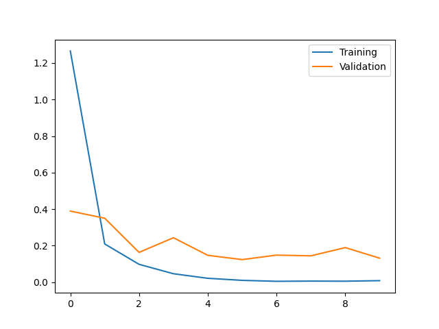

# Kaggle Plant Seedlings Classification

A PyTorch example of the playground competition: 
https://www.kaggle.com/competitions/plant-seedlings-classification

Coding video: https://youtu.be/wk607MVBuno

## Prerequisites

```bash
pip install -r requirements.txt
```

## Run

```bash
python main.py [ARGUMENTS]
```

ARGUMENTS:
* `--data_root`: `str` path to the dataset.
* `--num_epochs`: `int` number of epochs
* `--batch_size`: `int` batch size
* `--eval_model`: `str` path to the model to be evaluated.


## Test Accuracy

- private test accuracy: 0.95465
- public test accuracy: 0.95465

## Loss Curve


